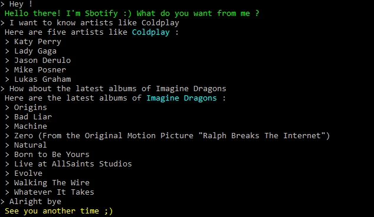

# Sbotify
Your assistant to search your favorite songs and artists ! 


## How To Use
- Clone this repository : `https://github.com/IlyessAgg/Sbotify`

```sh
❯ cd /path/to/workspace
❯ git clone git@github.com:IlyessAgg/Sbotify.git
```
- Install dependencies :

```
❯ npm i
```

- Launch the app :

```
❯ nodemon app.js
```

## FAQ
- **Here are some of the questions it can answer.**

<pre><code>> Give me an artist like <i>artist</i>
</code></pre>
<pre><code>> Can I get artists related to <i>artist</i>
</code></pre>
<pre><code>> Tell me the latest albums of <i>artist</i>
</code></pre>

## Usage


```
> Hello Bot !
 Hello there! I'm Ilyess's Bot :) What do you want from me ?
> What is the weather like in Paris
 Here's the current condition in Paris : Clear
 It's pretty cold ! Temperatures are around 4 degrees.
> Will it rain in Paris tomorrow
 Yes
> Will it be hot tomorrow in Paris
 No, here's the actual temperature : 9.9
> Bye
 See you another time ;)
```

## Licence

[Uncopyrighted](http://zenhabits.net/uncopyright/)
